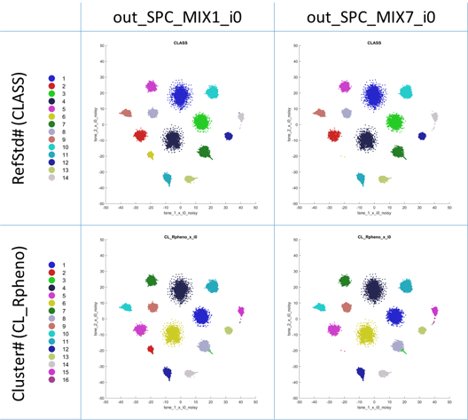

# 
AP-workflow is an automated phenotyping pipeline for unbiased detection of populations from flow cytometry (FCM) data; used for comparison of different FCM data input modes to evaluate how cytometry acquisition configuration and data compensation procedures affect the performance of unsupervised phenotyping tools.

## Description
The workflow comprises several stages based on state-of-the-art methods:
- Pre-processing of FCM data to transform fluorescence signals into a linear scale - Biexponential transformation
- Subsampling of FCM events to facilitate suitable processing of full datasets and multiple samples - Local density-dependent downsampling
- Dimensionality reduction of high-dimensional fluorescence signals for visualization purposes - tSNE
- Automatic clustering for unbiased detection of subpopulations - Phenograph
- Upsampling of FCM events to extend results to the whole set of original events and files export

## Citation
If you find AP-workflow useful in your research, please consider citing:
```
@article{jimenez2018flow,
  title={Flow Cytometry Data Preparation Guidelines for Improved Automated Phenotypic Analysis},
  author={Jimenez-Carretero, Daniel and Ligos, Jos{\'e} M and Mart{\'\i}nez-L{\'o}pez, Mar{\'\i}a and Sancho, David and Montoya, Mar{\'\i}a C},
  journal={The Journal of Immunology},
  volume={200},
  number={10},
  pages={3319--3331},
  year={2018},
  publisher={American Association of Immunologists}
}
```

## Prerequisites
The automated analysis pipeline was implemented as a script in Matlab and R.
- Matlab R2017a:
	- Parallel Computing Toolbox
	- Statistics Toolbox
- R version 3.3.2:
	- flowCore
	- cytofkit
	- flowMeans
	
## Configuration
Edit script_APworkflow.m to set up inputs and parameters.

## Running a test
Execute script_APworkflow.m after setting up "pthR" variable with your local path to R binaries
```
run script_APworkflow.m
```

Results will be available in the selected output folder
```
dir Example\X_OUT
```

# 